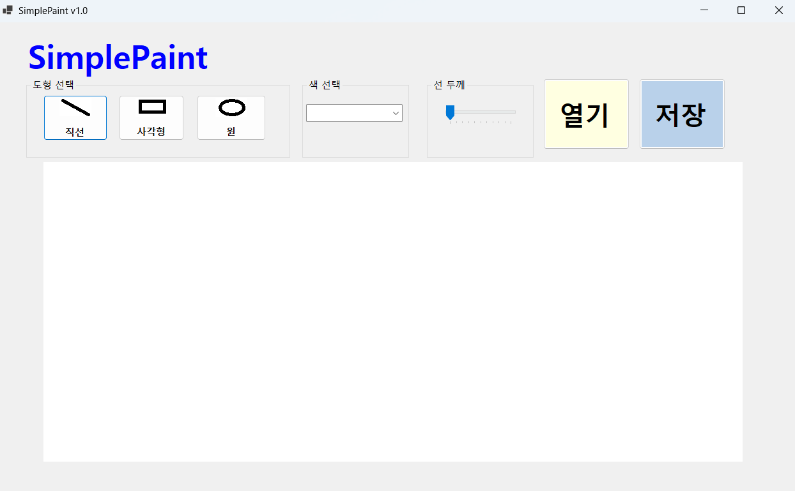
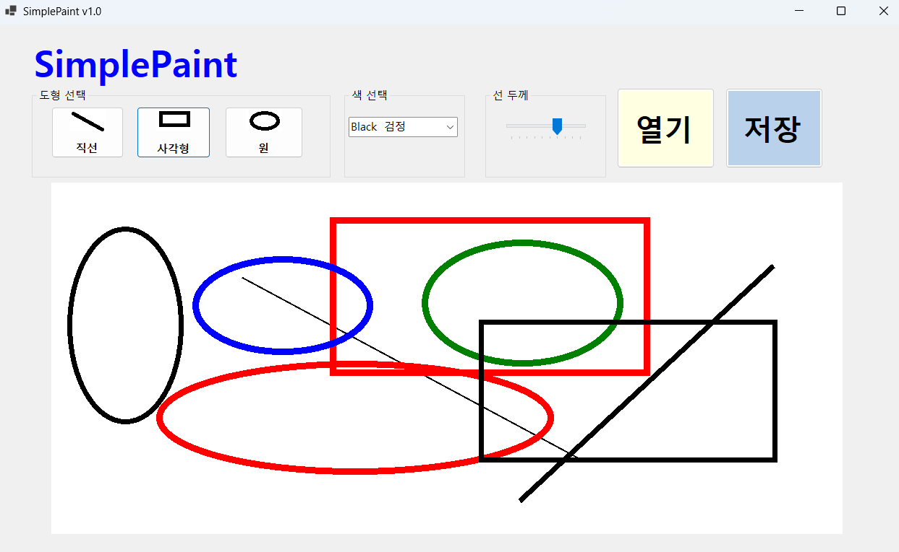

# (C# 코딩) 심플페인트 ## 개요
- C# 프로그래밍 학습
- 
- 1줄 소개: 직선, 사각형, 원을 그리는 그림판
- 사용한 플랫폼: 
- C#, .NET Windows Forms, Visual Studio, GitHub
- 사용한 컨트롤:Label, ComboBox,TrackBar, Button, GroupBox, PictureBox
- 
- 사용한 기술과 구현한 기능:

## 실행 화면 (과제1)
- 코드의 실행 스크린샷과 구현 내용 설명

- 구현한 내용 (위 그림 참조)
- UI 구성 : Label(앱 이름 표시), ComboBox(색상 선택 표시), PictureBox(그림 그리는 면),TrackBar(선 두께)
-콤보 박스를 통해 색상을 변경하는 창을 만듬
- 트랙 바를 이용해 선 두께를 조절
- 버튼이에 이미지를 삽입하여 사각형,원,선을 선택할 수 있게 만듬

## 실행 화면 (과제2)
- 코드의 실행 스크린샷과 구현 내용 설명

- 구현한 내용 (위 그림 참조)
- using 을 사용
- 다른 사람이 만든 클래스를 가져오고자 할 때 다른 네임스페이스에 있는 클래스들을 짧은 이름으로 사용할 수 있도록 해준다
- enum ToolType { Line, Rectangle, Circle }을 사용해 사용할 도형 타입을 선택하게 함

private Bitmap canvasBitmap;        // 실제 그림이 저장되는 비트맵 - 이 객체에 저장됨
private Graphics canvasGraphics;    // 비트맵 위에 그리기 위한 객체

canvasBitmap = new Bitmap(picCanvas.Width, picCanvas.Height);
canvasGraphics = Graphics.FromImage(canvasBitmap);
canvasGraphics.Clear(Color.White);
로 캔버스를 흰색으로 초기화시킨다

picCanvas.MouseDown += PicCanvas_MouseDown;
picCanvas.MouseMove += PicCanvas_MouseMove;
picCanvas.MouseUp += PicCanvas_MouseUp;
로 마우스 이벤트를 연결함

btnLine.Click += btnLine_Click; 
btnRectangle.Click += btnRectangle_Click; 
btnCircle.Click += btnCircle_Click;
로 도형 선택 버튼 이벤트를 연결함

cmbColor.SelectedIndexChanged += cmbColor_SelectedIndexChanged;
cmbColor.SelectedIndex = 0;
로 색상 콤보박스 이벤트 연결

switch case 문으로
도형을 선택할 시 연결되는 로직을 실행

